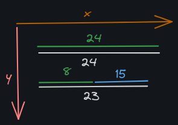

# Assignment 2 – Cyclic Cross Correlation

In this assignment, we delve into the world of cyclic cross-correlation, a fundamental tool for detecting similarities between discrete signals. Given signals $x(k)$
and  $y(k)$, where $0 \leq k < N$, the circular cross-correlation ( $rxy (\tau)$ ) is defined by the formula:

$rxy (\tau) = \sum_{k=0}^{n-1} x(k) \cdot y[(\tau+k) \mod n]$

The reference implementation, housed in `cyclicCircConv.cu`, facilitates exploration by running the computation kernel on both the CPU and GPU. Our primary task is to optimize the thread launch grid and assess the viability of offloading computations to a GPU device. Using `cyclicCircConvDouble.cu`, we aim to present execution time plots and explanations for various thread launch grids, while also investigating factors influencing GPU performance. The ultimate goal is to draw conclusions regarding the efficiency of GPU offloading.

## Contributors

| Author               | N Mec  | Contribution Percentage |
| -------------------- | ------ | ----------------------- |
| Gonçalo Silva       | 103244 | 50%                     |
| Catarina Barroqueiro | 103895 | 50%                     |

## Summary: Significant Figures

The general rule establishes that the number of significant figures in the result should not exceed the number from the most imprecise measurement used.

### Provided Data:

- Mean Value (Average): 2.538921 (7 significant figures)
- Standard Deviation: 0.0025 (4 significant figures)

### Application of the Rule:

By rounding the mean value to match the number of significant figures in the standard deviation, we obtain:

- Rounded Mean Value: 2.539 (4 significant figures)

Therefore, to maintain consistent precision, the final result should be expressed as 2.539, with four significant figures.

---

# About GPU

* **Multiple-Instruction Multiple-Data (MIMD)**, offers parallelism for both data and processing. Multiple processors execute instruction streams independently against different data streams
* **Single-Instruction Multiple-Data (SIMD)**, architecture has a single control processor and instruction memory, so only one instruction can be run at any given point in time. That single instruction is copied and ran across each core at the same time. This is possible because each processor has its own dedicated memory which allows for parallelism at the data-level
* **Streaming Multiprocessor Instruction Dispatch (SMID)**, is basically a **Pipeline**, with multiple stages, where each perform a specific operation on the data. With this break-down, the a processor ca execute multiple instructions on different (independent) data simultaneously.
* **Single-Instruction Multiple-Thread (SIMT)**, means that each thread executes the same instruction on different data
* **Kernel**: Cuda function identified by the `__global__` macro, that is meant to be parallelized and executed on the GPU. It's executed by launching it with a specified number of threads. The threads are organized into a grid of blocks, where each block contains a number of threads. The kernel is executed by a large number of threads in parallel, with each thread executing the same code but operating on different data, this allows the GPU to execute multiple instructions simultaneously.
* The GPU is based on the **MIMD** architecture, with multiple **SMID** processors which are based on a **Pipeline**. This means that upon the execution of a program the launching grid will dictate the number of threads, and each thread will execute the same **kernel**, with multiple data.
* Good AMD slides [here](https://pages.cs.wisc.edu/~david/courses/cs758/Fall2016/handouts/hower13_gpu_lecture-6up.pdf)
* Each **Streaming Multiprocessor (SM)** has it's own registers, memory and functional unit. Each block of threads is executed in the same SM, with each thread having a small register count and memory address, while also being able to access the Blocks global memory (however it'll have to compete with other threads)
* A **warp** is a collection of 32 threads that execute in parallel (the maximum allowed in a block to execute simultaneously). They execute based on **SMIT** architecture, with the CUDA compiler and the GPU making the most to ensure that they execute the same instructions simultaneously as possible, however there can be also forced synchronization points defined by the user
* The **warp size** is the number of threads that are executed together in parallel. If you divide the warp size by the number of threads per block, you get the number of warps per block. For example, if the warp size is 32 and the number of threads per block is 64, then there are 2 warps per block.
  * The number of warps per block are limited to 32, which means $32 \times 32 = 1024$  threads

## Execution

Consider the following situations in Thread launching:

* nº of threads in *BlockThread* < *WarpSize*: The full hardware is not being utilized, because there are inactive computacional elements inside the **SM**
* nº of threads in *BlockThread* = *WarpSize*: All computacional elements inside the **SM** are active and being used
* nº of threads in *BlockThread* > *WarpSize*: Threads of *BlockThread* will be divided into multiple **warps**

Example: Consider that the number of Threads in *BlockThread* is 47. How will they be divided and processed? -> **Linearly**

* Each warp executes with 32 threads at a time, so 2 warps are going to be needed

  * 1º Warp is complete with 32 Threads (24 of first row, plus 8 of second)
  * 2º Warp is incomplete, getting the remaing 15 Threads
    
* Possible question: **What is the position of a Thread in a Warp?**

Threads in a *BlockThread* are executed concurrently in an available **SM**. However the execution of a *BlockThread* in a *GridBlock* is attributed by the scheduller.

## Stride

The difference between a program with and without stride is that the stride parameter determines the movement of the kernel across the input data. When performing a convolution operation, the stride determines how many units the filter shifts at each step. This shift can be horizontal, vertical, or both, depending on the stride’s configuration.

In a program without stride, the kernel would move across the input data in a fixed pattern, such as moving one pixel at a time. This would result in a lot of redundant computation and slow down the program.

In contrast, a program with stride would move the kernel across the input data in a more flexible pattern, such as moving two pixels at a time. This would reduce the amount of redundant computation and speed up the program.

Here is an example of how stride is used in CUDA programming. Consider the following loop:

```C
for (int i = index; i < ITERATIONS; i =+ stride) {
    C[i] = A[i] + B[i];
}
```

In this loop, `stride` is used to control the number of iterations that each thread performs. The `stride` value is set to `blockDim.x * gridDim.x`, which is the total number of threads in the grid. The `index` value is set to `blockIdx.x * blockDim.x + threadIdx.x`. This loop is called a **grid-stride loop**.

The grid-stride loop is used to write flexible kernels that can handle any size of input data. By using the grid-stride loop, you can eliminate overhead from scheduling and retiring blocks, which can lead to considerable efficiency gains in simple kernels.

## Memory

The memory hierarchy consists of (the sizes correspond to the memory of Nvidia GTX 1660 TI):

* **registers**: Information may not be totally accurate
  * The GPU has 8k or 16k registers (depending on the compute capability, see programmer’s guide for more info) which are shared between all threads within a thread block. so if you have, e.g., 256 threads per block, each thread can use up to 32 or 64 registers.
* **shared memory**: capacity per block is 48 kb
* **L1 cache**: 64 Kb per **SM**
* **L2 cache**: 1536 KB
* **Global memory**: 6GB
  * **Memory Type**: GDDR6
  * **Memory Bus**: 192 bit
  * **Bandwidth**: 288.0 GB/s
* **FP16 (half)**: 10.87 TFLOPS (2:1)
* **FP32 (float)**: 5.437 TFLOPS
* **FP64 (double)**: 169.9 GFLOPS (1:32)
* **SM Count**: 24

Said by teacher:

* Cache is 24 bytes
* Because we are dealing with Floating-Point, each number has 8 bytes, which means we can only save 3 numbers

## Program info

Circular cross-correlation is an important tool to detect similarities between a pair of signals. Let $x(k)$ and $y(k)$, with $0≤k<N$, be two discrete signals, then the circular $\text{cross-correlation}_\text{rxy}(τ)$ is defined by the formula:

$$
r_{xy}(\tau) = \sum_{k=0}^{n-1} x(k) \cdot y[(\tau+k) \mod n]
$$

From the formula, we can take the following conclusions:

* Nº of multiplications: $n²$
* Nº of additions: $(n-1)n$

In a 16 bit **CRC**:

* $n = 2^{16}$
* Nº of multiplications: $2^{32} \equiv 4 \times 10^9$
* Nº of additions: $(2^{32}-2^{16}) \times 2^{32} \equiv 4 \times 10^9$

## Other Questions

Why does the executions in the GPU exhibit higher variances until the *BlockThread* = *WarpSize*?

* **Variance until _BlockThread_ = _WarpSize_:** When the number of threads in a block (_BlockThread_) is less than the warp size (_WarpSize_), it can lead to higher variances in execution times. This occurs because threads within a warp execute in lockstep. If the number of threads in a block is not a multiple of the warp size, some warps might not be fully occupied, resulting in under-utilization of available hardware resources within the SM (Streaming Multiprocessor). This under-utilization can cause variations in execution times as some threads may be active while others within the partially filled warps might remain idle.

* **Impact of Thread Load Imbalance:** when _BlockThread_ < _WarpSize_, the hardware may not be fully utilized, leading to some threads experiencing more significant loads while others might have minimal or no load. This load imbalance can result in variations in execution times as the work distribution across threads isn't uniform.
* **Effect of Grid Size Modification:** Modifying the grid size generally has less impact on execution times' variance compared to block size adjustments. The grid size determines the number of thread blocks that can be scheduled across SMs, and as you rightly noted, it's typically handled by the scheduler. Therefore, variations in grid size might not significantly affect execution times or cause notable variances since it involves the allocation of thread blocks to available SMs without directly influencing thread execution within a block.

Why does the execution time stays flat after 32 Threads in *BlockThread*, but at 512 in increases slightly?

Can you interpret the cache misses and their impact in this program?

## Extra

Executing nvprof revealed the following output:

```text
==8681== NVPROF is profiling process 8681, command: ./cyclicCircConvDouble
Using Device 0: GeForce GTX 1660 Ti
The initialization of host data took 1.487e-03 seconds
The creation and transfer of 1048576 bytes from the host to the device took 1.960e-01 seconds
The CUDA kernel <<<(2048,1,1), (32,1,1)>>> took 6.853e-02 seconds to run
The transfer of 524288 bytes from the device to the host took 9.347e-05 seconds
The cpu kernel took 3.104e+00 seconds to run (single core)
All is well!
==8681== Profiling application: ./cyclicCircConvDouble
==8681== Profiling result:
            Type  Time(%)      Time     Calls       Avg       Min       Max  Name
 GPU activities:   99.82%  68.488ms         1  68.488ms  68.488ms  68.488ms  cyclicCircConv_cuda_kernel(double*, double*, double*, unsigned int)
                    0.12%  85.541us         2  42.770us  42.371us  43.170us  [CUDA memcpy HtoD]
                    0.06%  39.939us         1  39.939us  39.939us  39.939us  [CUDA memcpy DtoH]
      API calls:   51.94%  195.84ms         3  65.280ms  2.9160us  195.83ms  cudaMalloc
                   29.49%  111.17ms         1  111.17ms  111.17ms  111.17ms  cudaDeviceReset
                   18.17%  68.494ms         1  68.494ms  68.494ms  68.494ms  cudaDeviceSynchronize
                    0.15%  584.25us       194  3.0110us     170ns  126.20us  cuDeviceGetAttribute
                    0.07%  271.23us         1  271.23us  271.23us  271.23us  cudaGetDeviceProperties
                    0.06%  235.76us         2  117.88us  69.781us  165.98us  cuDeviceTotalMem
                    0.06%  234.73us         3  78.243us  48.841us  93.044us  cudaMemcpy
                    0.02%  92.672us         3  30.890us  3.0750us  83.937us  cudaFree
                    0.01%  54.712us         2  27.356us  26.089us  28.623us  cuDeviceGetName
                    0.01%  37.159us         1  37.159us  37.159us  37.159us  cudaLaunchKernel
                    0.00%  3.0860us         2  1.5430us  1.2320us  1.8540us  cuDeviceGetPCIBusId
                    0.00%  2.0640us         1  2.0640us  2.0640us  2.0640us  cudaSetDevice
                    0.00%  1.0210us         4     255ns     190ns     371ns  cuDeviceGet
                    0.00%     963ns         3     321ns     231ns     501ns  cuDeviceGetCount
                    0.00%     530ns         2     265ns     230ns     300ns  cuDeviceGetUuid
                    0.00%     210ns         1     210ns     210ns     210ns  cudaGetLastError
```

### This part was obtained in class

* Inefficient access to memory by multiple threads can occur, due to the fact sequential threads will access non-contiguous memory sections which will result in more memory transactions and more cache thrashing
* It should be noted that from 64 threads per block (results in 16 blocks) and onward, full GPU occupancy is no longer possible because the GPU used has 24 SMs and because all threads in a block are run on the same SM.
* Although adjacent threads now access contiguous memory regions, every element of each sequence is now very far from each other, so every time a thread accesses a new sequence element there is a high likelihood of that element not being present in the cache.
* As the number of threads per block reaches 64 (which results in 16 blocks) and up, the number of blocks is no longer enough for full GPU occupancy given that there are 24 SMs in the GPU used. Even with this factor in play, the execution time suffered very little, because every sequence access requires the values to be fetched from main memory allowing for the SM to run another warp while waiting for the memory transaction to complete thus hiding the memory access latency. This is the main reason for the lack of scalability of the execution time.
